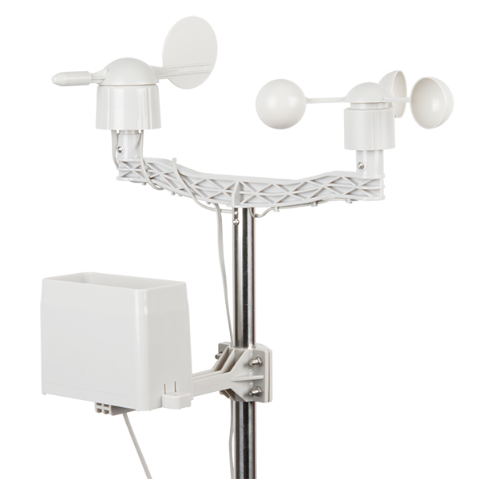

# CSSE4011 Weather Station IoT Demo


This project is an IoT demo designed for the M5Stack Core2. It focuses on measuring wind speed and wind direction using a weather station sensor, then transmitting the data to a server via HTTP.

## Features

- **Wind Speed Measurement:**  
  Uses a GPIO interrupt to count wind sensor pulses for calculating wind speed.
  
- **Wind Direction Measurement:**  
  Reads ADC values from the wind direction sensor and converts them into degrees.

- **IoT Connectivity:**  
  Sends sensor data as a JSON payload to a remote server using HTTP POST.

## Requirements

- **Hardware:**  
  - M5Stack Core2  
  - Weather Meter Kit (Sparkfun)

- **Software:**  
  - Zephyr RTOS  
  - West command-line tool
  - Proper toolchain configured for the M5Stack Core2

## Setup and Build Instructions

1. **Navigate to the Application Directory:**

   ```sh
   cd app/
   ```

2. **Build the Application:**

   Perform a pristine build to ensure all files are recompiled:

   ```sh
   west build --pristine
   ```

3. **Flash the Application:**

   Once the build is complete, flash the binary to your M5Stack Core2 device:

   ```sh
   west flash
   ```

4. **Monitor the Device Logs:**

   To view real-time logs and monitor sensor readings:

   ```sh
   west espressif monitor
   ```

## Overview

- **Initialization:**  
  - **ADC Initialization:** Sets up the ADC to read wind direction values.  
  - **Weather Station Setup:**  
    - Initializes the weather station module with calibration parameters.  
    - Configures the GPIO for the wind speed sensor with an interrupt and registers a callback.  
  - **WiFi Connection:** Connects the device to WiFi for server communication.

- **Main Loop:**  
  - Collects sensor data (wind speed and wind direction).  
  - Formats the data into a JSON payload.  
  - Connects to the remote server, sends an HTTP POST request, and processes the response.  
  - Waits for a configured interval before repeating the cycle.

## License

This project is licensed under the Apache-2.0 license.

## Contact

For issues or further inquiries, please refer to the project repository or contact the project maintainer.